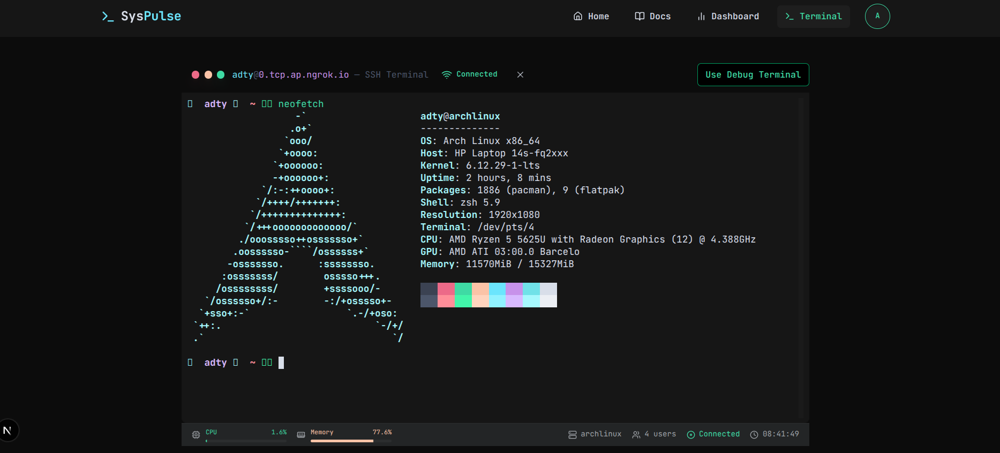
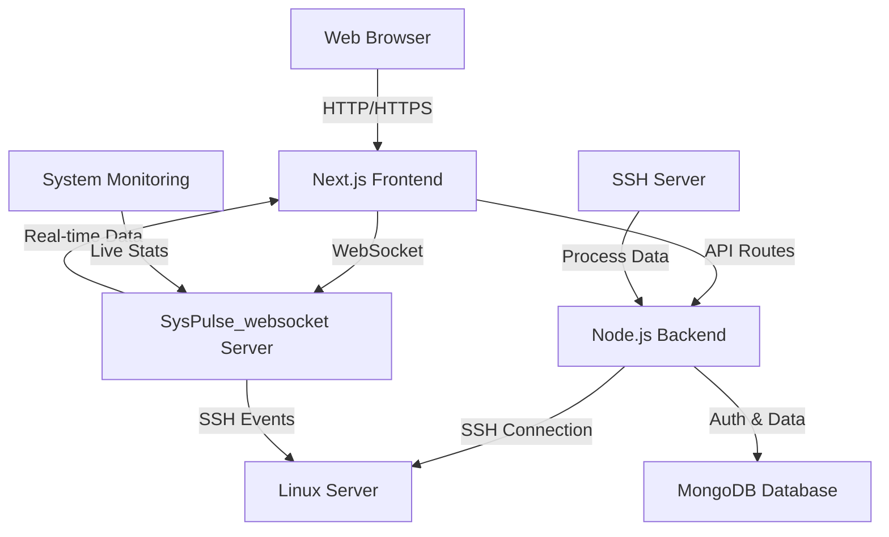

# SysPulse
## 📋 About This Project

SysPulse was developed as a final project for the Operating Systems course. It demonstrates practical application of operating system concepts including process management, system monitoring, and remote system administration through a modern web interface.

### 👨‍💻 Project Team

| Team Member 
|-------------|
| Ginanjar Aditiya Prianata |
| Azka Hasyyati Bayan |
| Andi Rafiyan |
| Kevin Ibrahimovic |
| Angra Advian Maulana |

## 📊 Overview

SysPulse is a modern Next.js-based web dashboard for monitoring and managing Linux processes through SSH connections. It provides a user-friendly interface for real-time system monitoring, process control, and server management with secure authentication and responsive design.

**Related Repositories:**
- [SysPulse_websocket](https://github.com/kudith/SysPulse_websocket) - WebSocket server for real-time communication

## ✨ Key Features

- **🖥️ Remote Process Management**: Monitor and manage Linux processes through secure SSH connections
- **📊 Real-time System Monitoring**: View CPU, memory usage, and system load with live updates
- **⚡ Process Control**: Start, stop, kill, and renice processes directly from the web interface
- **💻 Interactive Terminal**: Built-in web terminal with XTerm.js for direct command execution
- **🌐 Multi-server Support**: Connect to and manage multiple Linux servers from a single dashboard
- **🔒 Secure Authentication**: NextAuth-based authentication with role-based access control
- **📱 Responsive Design**: Fully responsive interface optimized for desktop and mobile devices

## 🎓 Academic Relevance

This project implements key Operating System concepts:
- **Process Management**: Real-time monitoring and control of processes
- **Resource Management**: CPU, memory, and I/O monitoring
- **Signals and IPC**: Process signaling (kill, pause, resume)
- **Scheduling**: Process priority management through renice
- **Terminal Emulation**: Full terminal access with command execution
- **System Administration**: Remote system management via SSH

## 🖥️ Screenshots

<p align="center">
  
  
</p>

## 🚀 Getting Started

### Prerequisites

- **Node.js** (v16 or higher)
- **npm** or **yarn**
- **MongoDB** (for user authentication)
- **SSH access** to target Linux servers

### Installation

1. **Clone the main repository:**
```bash
git clone https://github.com/kudith/SysPulse.git
cd SysPulse
```

2. **Clone the WebSocket repository** ([SysPulse_websocket](https://github.com/kudith/SysPulse_websocket)):
```bash
# Clone in the same parent directory as SysPulse
cd ..
git clone https://github.com/kudith/SysPulse_websocket.git
```

3. **Install dependencies for both repositories:**
```bash
# Install dependencies for main repository
cd SysPulse
npm install

# Install dependencies for WebSocket repository
cd ../SysPulse_websocket
npm install
```

4. **Configure environment variables:**

**For main repository (SysPulse):**
```bash
cd SysPulse
cp .env.example .env
```

Edit the `.env` file with your configuration:
```env
# Database Configuration
MONGODB_URI=mongodb://localhost:27017/syspulse

# NextAuth Configuration
NEXTAUTH_URL=http://localhost:3000
NEXTAUTH_SECRET=your-nextauth-secret-key

# SSH Configuration (optional)
DEFAULT_SSH_PORT=22
SSH_TIMEOUT=30000
```

**For WebSocket repository:**
```bash
cd ../SysPulse_websocket
cp .env.example .env
```

Edit the WebSocket `.env` file:
```env
# WebSocket Server Configuration
WEBSOCKET_PORT=8080
CORS_ORIGIN=http://localhost:3000

# SSH Configuration
SSH_TIMEOUT=30000
MAX_CONNECTIONS=10
```

5. **Start the development servers:**

**Terminal 1 - Main Application:**
```bash
cd SysPulse
npm run dev
```

**Terminal 2 - SSH Server:**
```bash
cd SysPulse
npm run ssh-server
```

**Terminal 3 - WebSocket Server:**
```bash
cd ../SysPulse_websocket
npm run dev
```

6. **Access the application:**
   Open your browser and navigate to `http://localhost:3000`

## 🛠️ Tech Stack

### Core Technologies
- **Next.js 15** - React framework with server-side rendering and API routing capabilities
- **React 19** - Modern UI library for building interactive interfaces
- **TypeScript 5** - Static typing for code stability and maintainability
- **Tailwind CSS** - Utility-first CSS framework for rapid UI development
- **Node.js** - JavaScript runtime for server-side operations and SSH connections

### Authentication & Database
- **NextAuth 4** - Complete authentication solution with multiple provider support
- **MongoDB** - NoSQL database for storing user authentication data and configuration
- **Mongoose** - MongoDB object modeling with schema validation

### SSH & System Monitoring
- **SSH2** - Node.js library for establishing SSH connections to Linux servers
- **Express** - Web framework for handling HTTP requests and API routes
- **dotenv** - Environment variable management

### Real-time Communication
- **Socket.io** - Real-time bidirectional event-based communication
- **WebSockets** - Protocol for real-time client-server communication
- **[SysPulse_websocket](https://github.com/kudith/SysPulse_websocket)** - Dedicated WebSocket server

### UI Components & Libraries
- **Radix UI** - Unstyled, accessible components for building high-quality design systems
- **Lucide React** - Beautiful and customizable SVG icons
- **Framer Motion** - Production-ready motion library for React
- **XTerm.js** - Terminal emulator component for browser-based command execution
- **Recharts** - Composable charting library for React applications
- **React Hook Form** - Performant forms with easy validation
- **Zod** - TypeScript-first schema validation library

## 📊 System Architecture



## 💻 Key Capabilities

### Process Management
- **📋 Process Listing**: View all running processes with detailed information (PID, CPU, memory usage)
- **🔍 Process Filtering**: Search and filter processes by name, user, or resource usage
- **⚡ Process Control**: Send signals to processes (kill, terminate, pause, resume)
- **🎯 Priority Management**: Change process priorities using renice functionality

### System Monitoring
- **📈 Resource Monitoring**: Real-time charts for CPU, Memory, Disk, and Network usage
- **📊 System Statistics**: Comprehensive system information and performance metrics
- **⏱️ Performance Metrics**: Continuous monitoring of system performance indicators

### Terminal & Command Execution
- **💻 Web Terminal**: Direct terminal access for command execution with full XTerm.js integration
- **🔗 Interactive Shell**: Fully-featured terminal emulator with command history
- **📝 Session Management**: Persistent terminal sessions across connections

### User Management & Security
- **🔐 SSH Authentication**: Secure SSH user access control and permission management
- **👥 Multi-user Support**: Support for multiple users with role-based access control
- **🛡️ Secure Connections**: Encrypted SSH connections with authentication validation

## 🔌 WebSocket Server Integration

The real-time functionality is powered by a separate WebSocket server repository:

- **Repository**: [SysPulse_websocket](https://github.com/kudith/SysPulse_websocket)
- **Purpose**: Handles real-time communication between clients and Linux servers
- **Key Features**:
  - 📡 Live system metrics streaming
  - 🔄 Real-time process updates
  - 💻 Terminal session management
  - 🔔 Event-based notifications
  - ⚡ Low-latency data transmission

## 🚀 Project Structure

```
SysPulse/
├── app/                    # Next.js 13+ App Router
│   ├── terminal/          # Terminal page and components
│   ├── api/               # API routes for backend functionality
│   ├── page.tsx           # Main dashboard page
│   └── globals.css        # Global styles and CSS variables
├── components/            # Reusable UI components
│   ├── ui/               # Base UI components (Radix UI primitives)
│   ├── terminal/         # Terminal-specific components
│   ├── control-panel.tsx # Process control panel with kill/renice
│   ├── process-table.tsx # Process listing and management table
│   └── header.tsx        # Application header and navigation
├── lib/                  # Utility functions and shared logic
│   ├── ssh-service.ts    # SSH connection management service
│   ├── system-monitoring/ # System statistics monitoring utilities
│   ├── types.ts          # TypeScript type definitions
│   └── utils.ts          # General utility functions
├── public/               # Static assets and resources
│   └── assets/           # Images, icons, and static files
├── hooks/                # Custom React hooks
└── package.json          # Project dependencies and scripts

SysPulse_websocket/       # Separate WebSocket server repository
├── src/                  # WebSocket server source code
├── lib/                  # WebSocket utility functions
└── config/               # Server configuration files
```

## 🔧 Configuration

### Environment Variables

**SysPulse (Main Application):**
```env
# Database Configuration
MONGODB_URI=mongodb://localhost:27017/syspulse

# NextAuth Configuration
NEXTAUTH_URL=http://localhost:3000
NEXTAUTH_SECRET=your-nextauth-secret-key

# SSH Configuration
DEFAULT_SSH_PORT=22
SSH_TIMEOUT=30000

# Application Configuration
NODE_ENV=development
PORT=3000
```

**SysPulse_websocket (WebSocket Server):**
```env
# WebSocket Server Configuration
WEBSOCKET_PORT=8080
CORS_ORIGIN=http://localhost:3000

# SSH Configuration
SSH_TIMEOUT=30000
MAX_CONNECTIONS=10

# Security Configuration
ALLOWED_HOSTS=localhost,127.0.0.1
```

### Available Scripts

**Main Application (SysPulse):**
- `npm run dev` - Start development server
- `npm run build` - Build for production
- `npm run start` - Start production server
- `npm run lint` - Run ESLint
- `npm run ssh-server` - Start SSH server component

**WebSocket Server:**
- `npm run dev` - Start WebSocket development server
- `npm run build` - Build WebSocket server
- `npm run start` - Start WebSocket production server

## 🤝 Contributing

Contributions are always welcome! Please read our [contribution guidelines](CONTRIBUTING.md) first.

### Development Workflow

1. **Fork the repository**
2. **Create a feature branch**: `git checkout -b feature/amazing-feature`
3. **Commit your changes**: `git commit -m 'Add some amazing feature'`
4. **Push to the branch**: `git push origin feature/amazing-feature`
5. **Open a Pull Request**

### Development Guidelines

- Use TypeScript for type safety and better developer experience
- Follow consistent naming conventions throughout the codebase
- Add comprehensive documentation for new features
- Test changes thoroughly before submitting
- Ensure code meets linting and formatting standards
- Write meaningful commit messages

### Code Style

- Use Prettier for code formatting
- Follow ESLint rules for code quality
- Use meaningful variable and function names
- Add JSDoc comments for complex functions
- Keep components small and focused

## 📄 License

This project is licensed under the MIT License - see the [LICENSE](LICENSE) file for details.

## 📞 Contact & Support

If you have any questions or need help:

- 🐛 **Bug Reports**: [Create an issue](https://github.com/kudith/SysPulse/issues/new?template=bug_report.md)
- 💡 **Feature Requests**: [Create an issue](https://github.com/kudith/SysPulse/issues/new?template=feature_request.md)
- 📧 **Email**: [contact@example.com](mailto:contact@example.com)
- 💬 **Discussions**: [GitHub Discussions](https://github.com/kudith/SysPulse/discussions)

## 🎓 Academic Context

This project was developed as a final examination project for the Operating Systems course. It demonstrates practical application of key operating system concepts including:

- Process management and control
- System resource monitoring
- Signal handling and inter-process communication
- User access control and security
- Terminal emulation and command execution
- Remote system administration

## 🚀 Roadmap

- [ ] **Docker Containerization** - Easy deployment with Docker and Docker Compose
- [ ] **Internationalization (i18n)** - Multi-language support for global users
- [ ] **Advanced Monitoring Dashboards** - Enhanced visualizations and metrics
- [ ] **Plugin System** - Extensible architecture for custom functionality
- [ ] **Mobile App Companion** - Native mobile app for iOS and Android
- [ ] **Enhanced Security Features** - Two-factor authentication, audit logs
- [ ] **Performance Optimizations** - Improved loading times and resource usage
- [ ] **API Documentation** - Comprehensive API docs with Swagger/OpenAPI
- [ ] **Automated Testing** - Unit, integration, and E2E test coverage
- [ ] **Cloud Deployment** - One-click deployment to major cloud providers

## 🏆 Acknowledgments

- Thanks to all team members who contributed to this project
- Special thanks to our Operating Systems course instructor for guidance
- Appreciation for the open-source community and the tools that made this project possible
- Inspired by modern system administration and DevOps practices

---

<p align="center">
  <strong>Built with ❤️ by the SysPulse Team</strong><br>
  Operating Systems Course Final Project
</p>