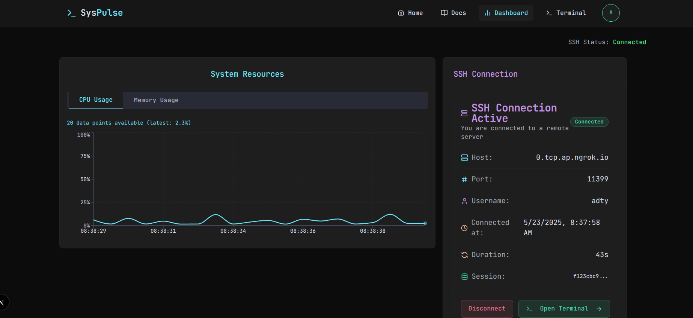
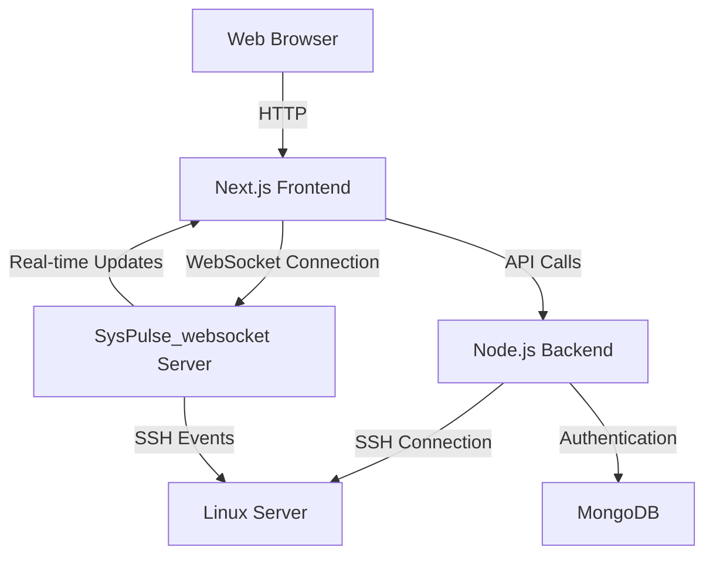

# SysPulse

<p align="center">
  
</p>

<p align="center">
  <a href="https://github.com/kudith/SysPulse/actions"></a>
  <a href="https://github.com/kudith/SysPulse/blob/main/LICENSE"></a>
  <a href="https://github.com/kudith/SysPulse/releases"></a>
</p>

## 📊 Overview

SysPulse is a modern web-based dashboard interface for managing Linux processes through Secure Shell (SSH). It provides a user-friendly interface for monitoring, controlling, and managing system processes remotely, offering real-time data and command execution capabilities.

**Related Repositories:**
- [SysPulse_websocket](https://github.com/kudith/SysPulse_websocket) - WebSocket server for real-time communication

## ✨ Features

- **Remote Process Management**: Monitor and manage Linux processes through a secure SSH connection
- **Real-time System Monitoring**: View CPU, memory usage, and system load in real-time
- **Process Control**: Start, stop, kill, and renice processes directly from the web interface
- **Interactive Terminal**: Built-in web terminal for direct command execution
- **Multi-server Support**: Connect to and manage multiple Linux servers from a single dashboard
- **Secure Authentication**: Role-based access control with Next Auth authentication system
- **Responsive Design**: Fully responsive interface that works on desktop and mobile devices

## 🖥️ Screenshots

<p align="center">
  
</p>

## 🚀 Getting Started

### Prerequisites

- Node.js (v16 or higher)
- npm or yarn
- MongoDB (for user authentication)
- SSH access to Linux server(s)

### Installation

1. Clone the main repository:
```bash
git clone https://github.com/kudith/SysPulse.git
cd SysPulse
```

2. Clone the WebSocket repository ([SysPulse_websocket](https://github.com/kudith/SysPulse_websocket)):
```bash
git clone https://github.com/kudith/SysPulse_websocket.git
```

3. Install dependencies for both repositories:
```bash
# For main repository
cd SysPulse
npm install

# For WebSocket repository
cd ../SysPulse_websocket
npm install
```

4. Configure environment variables:
```bash
# For main repository
cd SysPulse
cp .env.example .env
# Edit .env file with your MongoDB connection string, Next Auth settings, etc.

# For WebSocket repository
cd ../SysPulse_websocket
cp .env.example .env
# Edit .env file with your WebSocket configuration
```

5. Start the development servers:
```bash
# Start main application
cd SysPulse
npm run dev

# Start WebSocket server (in a separate terminal)
cd SysPulse_websocket
npm run dev
```

6. Start the SSH server:
```bash
cd SysPulse
npm run ssh-server
```

7. Open your browser and navigate to `http://localhost:3000`

## 🛠️ Technologies

### Core Technologies
- **Next.js**: React framework for building efficient and modern web interfaces with server-side rendering and API routing capabilities
- **Tailwind CSS**: Utility-first CSS framework for rapid UI development with consistent and responsive design
- **Node.js**: JavaScript runtime for server-side operations, handling SSH connections and processing requests
- **TypeScript**: Static typing to ensure code stability and maintainability, especially in a collaborative environment
- **SSH2 (Node.js)**: Library for establishing SSH connections to Linux servers and executing remote commands

### Authentication & Database
- **Next Auth**: Complete authentication solution supporting multiple providers
- **MongoDB**: NoSQL database for storing user authentication data and application configuration

### Real-time Communication
- **WebSockets**: Protocol for real-time communication between client and server
- **Socket.io**: Real-time bidirectional event-based communication for live updates
- **[SysPulse_websocket](https://github.com/kudith/SysPulse_websocket)**: Dedicated WebSocket server in a separate repository

### UI Components
- **XTerm.js**: Terminal emulator component for browser-based command execution
- **Radix UI**: Unstyled, accessible components for building high-quality UI

## 📊 System Architecture



## 💻 Key Capabilities

- **Process Listing**: View all running processes with details like PID, CPU usage, memory usage
- **Process Filtering**: Search and filter processes by name, user, resource usage
- **Process Control**: Send signals to processes (kill, terminate, pause, resume)
- **Resource Monitoring**: Real-time charts of system resources (CPU, Memory, Disk, Network)
- **Terminal Access**: Direct terminal access for command execution
- **Job Scheduling**: Schedule and manage cron jobs
- **User Management**: Control SSH user access and permissions

## 🔌 WebSocket Server

The real-time functionality is powered by a separate WebSocket server repository:
- Repository: [https://github.com/kudith/SysPulse_websocket](https://github.com/kudith/SysPulse_websocket)
- Purpose: Handles real-time communication between clients and Linux servers
- Features:
  - Live system metrics streaming
  - Real-time process updates
  - Terminal session management
  - Event-based notifications

## 🚀 Project Structure

```
SysPulse/
├── app/               # Next.js application routes and components
├── components/        # Reusable UI components
├── lib/               # Utility functions and shared logic
├── public/            # Static assets
└── server/            # Server-side code for SSH connections

SysPulse_websocket/    # Separate repository: https://github.com/kudith/SysPulse_websocket
├── src/               # WebSocket server source code
├── lib/               # WebSocket utilities
└── config/            # WebSocket server configuration
```

## 🤝 Contributing

Contributions are always welcome! Please read our [contribution guidelines](CONTRIBUTING.md) first.

1. Fork the repository
2. Create a feature branch: `git checkout -b feature/amazing-feature`
3. Commit your changes: `git commit -m 'Add some amazing feature'`
4. Push to the branch: `git push origin feature/amazing-feature`
5. Open a pull request

## 📄 License

This project is licensed under the MIT License - see the [LICENSE](LICENSE) file for details.

## 👥 Team

- **Kudith** - *Project Lead & Developer* - [GitHub Profile](https://github.com/kudith)

## 📞 Contact

If you have any questions, feel free to reach out:

- Create an [issue](https://github.com/kudith/SysPulse/issues)
- Send an email to [contact@example.com](mailto:contact@example.com)
